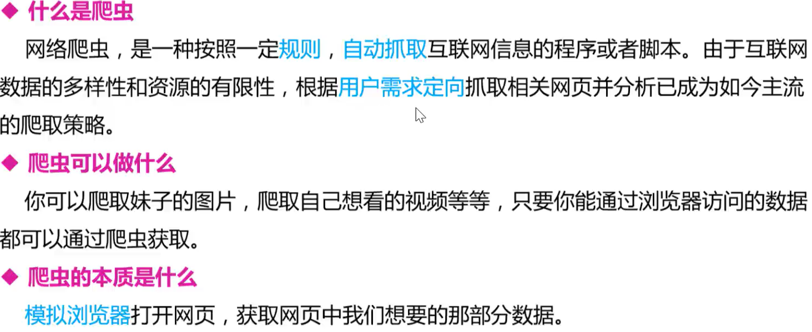
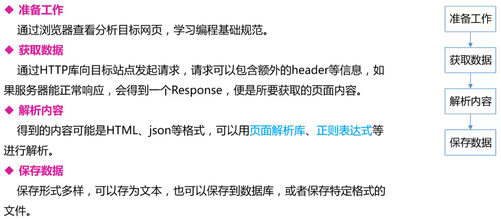
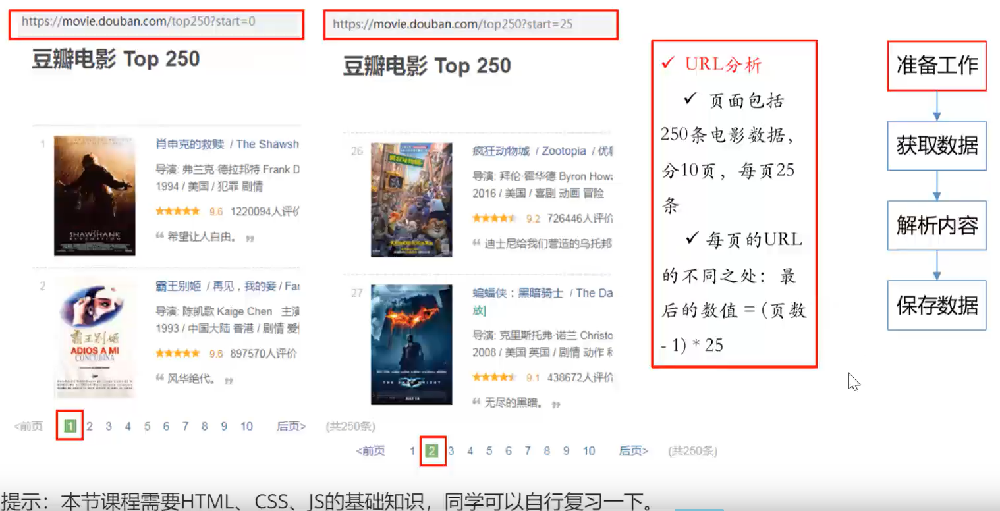
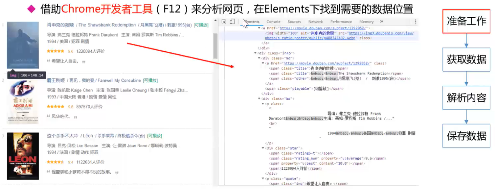
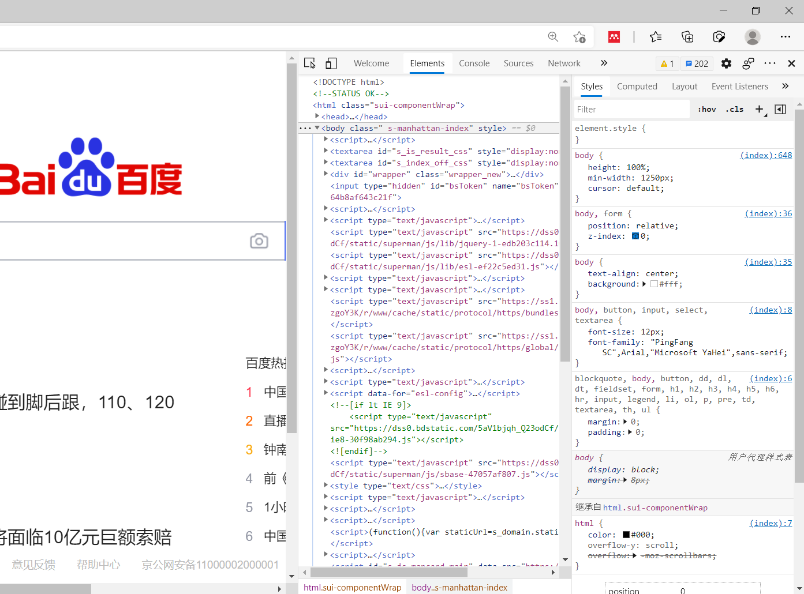
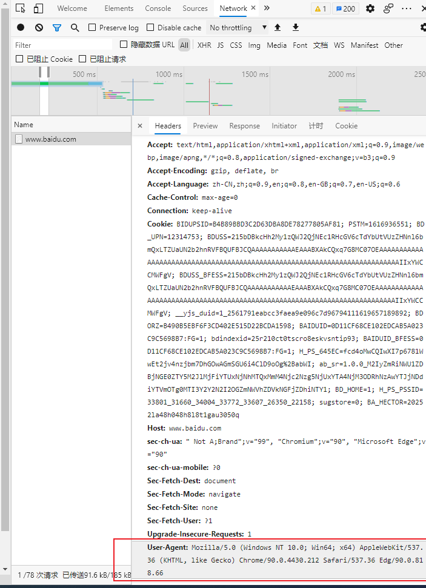
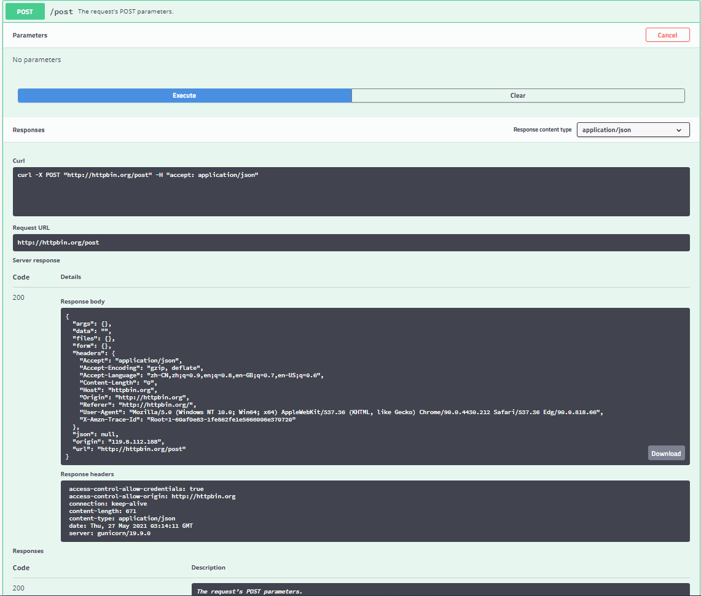
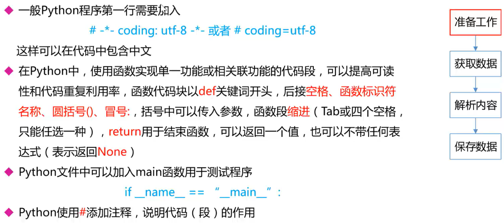
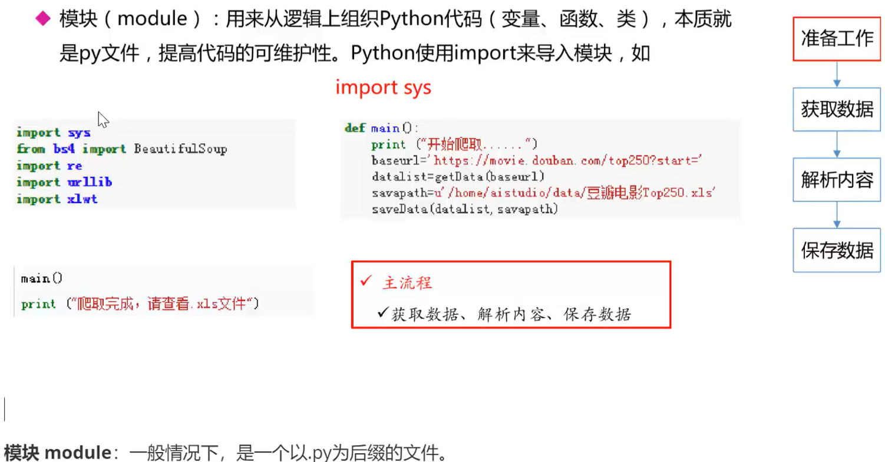
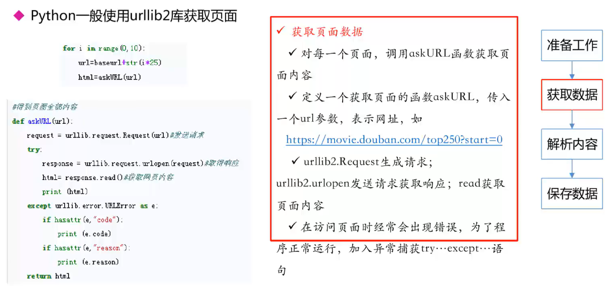

基础语法

## 运算符


## 条件判断语句


**注意判断条件后的冒号, 且必须缩进, 空格缩进和tab缩进均可**

```python
a = 10
if a >= 10:
    print("a>=10")
elif a >= 5:
    print(a >= 5)
else:
    print("a<5")
```

## 循环

### for循环

```python
for i in range(0, 10): # i>=0, i<10, 步进1
    print(i)
print("------------------------")
for i in range(0, 10, 3):  # i>=0, i<10, 步进3
    print(i)
```

### while循环

```python
# while测试
n = 100
sum = 0
counter = 1
while counter <=100:
    sum = sum + counter
    counter += 1

print("1到100的和为%d"%sum)

# while-else测试
counter = 1
while counter < 5:
    print("小于5")
    counter += 1
else:
    print("大于5")
```

### break, continue, pass

* break: 跳出for和while循环体
* continue: 跳出当前循环, 直接进入下一轮循环
* pass: 空语句, 一般用作占位语句, 不作任何事情

## 数据结构

### 字符串


* Python字符串可以使用单引号, 双引号, 和三引号(三个双引号)括起来, 使用反斜杠\转义特殊字符

* Python3源码文件默认以UTF-8编码, 所有字符串都是unicode字符串

* 支持字符串拼接, 截取等多种运算

```python
word ='字符串'
sentence = "这个一个句子"
paragraph = """
    这是一个段落
    可以有多行
    保留格式
"""
print(word)
print(sentence)
print(paragraph)

# 单引号和双引号有些区别
mystr1 = "I'm a student"
mystr2 = 'I\'m a student'  # 需要转义单引号
print(mystr1)
print(mystr2)
str = "chengdu"
print(str[1:7:2])  # 选择打印范围, 1~6, 步进2
print(str + "你好")  # 拼接
print(str * 3)  # 重复打印

# 转义字符与取消转义
print("hello\nchengdu")  # 反斜杠表示转义
print(r"hello\nchengdu")  # 前面加r表示直接显示, 没有转义功能
```

### 列表


  ```python
  namelist = ["孙悟空", "猪悟能", "沙悟净"]
  for name in namelist:
      print(name)
  
  # 增删改查测试
  print("增删改查测试")
  print("增")
  nametemp = input("请输入添加学生的姓名")
  namelist.append(nametemp)
  for name in namelist:
      print(name)
  # extend, insert
  
  print("删")
  del namelist[1]
  for name in namelist:
      print(name)
  
  # namelist.pop()  # 弹出最后一个元素
  # namelist.remove("孙悟空")  # 若有重复数据, 则只能删除第一个
  
  print("改")
  namelist[0] = "齐天大圣"
  for name in namelist:
      print(name)
  
  print("查")
  namefind = input("请输入要查找的名字")
  if namefind in namelist:
      print("找到了")
  else:
      print("不存在")
  
  print(namelist.index("齐天大圣", 0, 3)) # 在列表0~2的范围内查找"齐天大圣", 若查到, 则返回索引, 否则会报错
  
  print("看看列表里边有多少个齐天大圣")
  print(namelist.count("齐天大圣"))
  
  namelist.reverse()  # 反转
  namelist.sort()  # 排序(升序)
  namelist.sort(reverse=True)  # 排序(降序)
  
  ```

### 案例: 分配办公室

```python
import random

print("为每个老师随机分配办公室")

offices = [[], [], []]  # 嵌套列表
names = ["A", "B", "C", "D", "E", "F", "G", "H"]
for name in names:
    index = random.randint(0, 2)  # 随机分配索引
    offices[index].append(name)

# 打印每个办公室的人
i = 0
for office in offices:
    print("办公室%d内的人数为%d, 他们是: " % (i, len(office)))
    for name in office:
        print("%s" % name, end="\t")
    print("\n")
    i += 1
```

> 办公室0内的人数为4, 他们是: 
> A	B	E	H	
>
> 办公室1内的人数为3, 他们是: 
> C	D	F	
>
> 办公室2内的人数为1, 他们是: 
> G	

  ### 案例: 逛超市


```python
# 打印商品清单
productList = [["iphone", 6888], ["MacPro", 14800], ["小米6", 2499], ["Coffee", 31], ["Book", 60], ["Nike", 699]]
print("-"*10, "商品列表", "-"*10)

# productIndex = 0
# for product in productList:  # 逐个打印
#     print("%d\t%s\t%d" % (productIndex, product[0], product[1]))
#     productIndex += 1

# 用枚举函数替换上述代码
for i, product in enumerate(productList):
    print(i, product[0], product[1])

shopTrolley = []  # 购物车

productNumber = input("请输入要购买的商品编号(按q结束购物): ")

while not(productNumber is "q"):
    if int(productNumber) > len(productList):
        print("该商品不存在, 请重新输入")
        productNumber = input("请输入要购买的商品编号(按q结束购物): ")
    else:
        shopTrolley.append(productList[int(productNumber)])  # 添加被选择的物品
        productNumber = input("请输入要购买的商品编号(按q结束购物): ")

print("-"*10, "购物清单", "-"*10)

# productIndex = 0
# for product in shopTrolley:  #打印购物车
#     print("%d\t%s\t%d" % (productIndex, product[0], product[1]))
#     productIndex += 1

# 用枚举函数替换上面的代码
for i, product in enumerate(shopTrolley):
    print(i, product[0], product[1])

```

### 元组(tuple)

.png)

```python
tup1 = ("abc", "def", 2000, 2020, 333, 444, 555, 666)  # 必须用逗号隔开, 如果只有一个元素后面也必须加逗号

print(tup1[0])  # 访问第一个元素
print(tup1[-1])  # 访问最后一个元素
print(tup1[1:5])  # 左闭右开, 切片

# 增
tup2 = (12, 34, 56)
tup3 = ("abc", "xyz")
tup4 = tup2 + tup3
print(tup4)

# 删
# del tup2[0]  # tulle不允许删除
del tup2  # 删除了整个变量, 无法再进行打印
# print(tup2)

```

### 字典(dict, Java中叫Map)


```python
info = {"name": "孙悟空", "age": 500}

print(info["name"])
print(info["age"])

# print(info["gender"])  # 直接访问不存在的键, 会报错
print(info.get("gender"))  # 使用get方法, 若没有找到对应的键, 默认返回None
print(info.get("gender"), "m")  # 这是没有找到时的返回值, 返回m

# 增删改查
# 增
# newID = input("请输入学号: ")
# info["id"] = newID
# print(info["id"])

# 删, 分为del和clear, del可以删除整个变量, clear只是清空字典, 但是变量仍然存在
# del
print("删除一个键值对")
print("删除前: %s"%info["name"])
del info["name"]
# print("删除后: "%info["name"])  # 删除整个键值对, 再次访问报错

info["name"] = "孙悟空"

print("删除整个dict")
print("删除前: ")
print(info)
del info
print("删除后: ")
# print(info)  # 删除整个dict, 再次访问报错
print("-"*30)
# clear
info = {"name": "孙悟空", "age": 500}
print("清空: ")
print("请空前: ")
print(info)
info.clear()
print("清空后: ")
print(info)
print("-"*30)
# 查
info = {"id": "1", "name": "孙悟空", "age": 500}
print(info.keys())  # 打印所有的键(键的形式是列表)
print(info.values())  # 打印所有的值
print(info.items())  # 打印所有的项

# 遍历所有的键
print("遍历所以的键")
for key in info.keys():
    print(key)
# 遍历所有的值
print("遍历所有的值")
for value in info.values():
    print(value)
# 遍历所有的项(键值对)
print("遍历所有的项(键值对)")
for key, value in info.items():
    print("key = %s, value = %s"%(key, value))

# 使用枚举函数, 同时拿到列表中的下标和元素内容
myList = ["a", "b", "c", "d"]

for i, x in enumerate(myList):
    print(i, x)

```

### 集合(set)


### 数据结构小结


## 函数


```python
# 定义函数
def printinfo():
    print("-----------------------")
    print("      我乃齐天大圣")
    print("-----------------------")


printinfo()


# 带参数和返回值的函数
def add2Num(a, b):
    return a+b


result = add2Num(11, 22)
print(result)


# 多个返回值的函数
def divide(a, b):
    shang = a // b
    yushu = a % b
    return shang, yushu

sh, yu = divide(5, 2)
print("商: %d, 余: %d" % (sh, yu))

```

## 文件操作

```python
# 创建一个文件并打开
f = open("test.txt", "w")  # 打开文件, w模式下, 若文件不存在, 则新建
f.write("Hello world, I am here. -0\nHello world, I am here. -1\nHello world, I am here. -2")  # 写入内容
f.close()


# read方法: 读取文件中的字符, 开始时定位在文件头部, 每次执行之后自动后移
f = open("test.txt", "r")
content = f.read(5)  # 读5个字符
print(content)

content = f.read(5)  # 再读5个字符
print(content)

f.close()

# 一次性读取整个文档
f = open("test.txt", "r")
content = f.readlines()  # 读取结果是列表, 按行读, 从第一行一直读到最后一行

for i, temp in enumerate(content):  # 输出行号+内容
    print("第%d行: %s" % (i, temp), end="")
print("\n")
f.close()

# 每次读取1行
f = open("test.txt", "r")
content = f.readline()
print("第0行: %s" % content, end="")

content = f.readline()
print("第1行: %s" % content)
f.close()

# 重命名文件
# import os
# os.rename("test.txt", "test.txt")

```

## 错误与异常

```python
# 发生异常
print("----test 1----")  # 这一句正常执行

f = open("123.txt", "r")  # 打开一个不存在的文件, 报错, 下一句不再执行

print("----test 2----")

# 捕获异常
try:
    print("----test 1----")
    f = open("123.txt", "r")  # 不报错, 但下一句仍然不执行
    print("----test 2----")
except IOError:  # 文件没找到, 属于IO异常
    pass  # 捕获异常后, 执行的代码

# 同时捕获多个异常
try:
    print("----test 1----")
    f = open("123.txt", "r")  # 下面的代码不会执行, 异常也不会被捕获
    print("----test 2----")

    print(num)  # 这是一个NameError
except (NameError, IOError):  # 把可能发生的异常都放到这里
    print("产生错误了")

# 显示异常信息
try:
    print("----test 1----")
    f = open("123.txt", "r")  # 下面的代码不会执行, 异常也不会被捕获
    print("----test 2----")

    print(num)  # 这是一个NameError
except (NameError, IOError) as result:  # 把可能发生的异常都放到这里
    print("产生错误了")
    print(result)

# 捕获所有异常
try:
    print("----test 1----")
    f = open("123.txt", "r")  # 下面的代码不会执行, 异常也不会被捕获
    print("----test 2----")

    print(num)  # 这是一个NameError
except Exception as result:  # 承接所有异常
    print("产生错误了")
    print(result)

# 文件异常处理
import time

try:
    f = open("test.txt", "r")
    # f = open("123.txt", "r")  # 这里报错不能进入finally

    try:
        while True:
            content = f.readline()
            if len(content) == 0:
                break
            time.sleep(2)  # 每隔两秒打印一次
            print(content)
    finally:  # 如果读取过程中发生异常, 如上面的break, 也要保证文件正常关闭
        f.close()
        print("文件关闭")

except Exception as result:
    print("发生异常")
    print(result)

```


# 爬虫基础

## 任务介绍

爬取豆瓣电影Top250的基本信息, 包括电影的名称, 豆瓣评分, 评价数, 电影概况, 电影链接等

https://movie.douban.com/top250

## 爬虫初识



([百度指数]([百度指数 (baidu.com)](https://index.baidu.com/v2/index.html#/))可以查看关键词流量)

## 基本流程



## 准备工作



### 页面分析



* 按F12进入开发者模式, 点击Elements可以查看页面源码, 点击左上角箭头可以在页面中选择一个元素进行检查

  

* 点击Elements可以捕获向页面发送的请求, 在Headers中可以看到浏览器信息等, 爬虫时需要进行对应的封装

  

HTTP请求/响应测试网站[httpbin.org](http://httpbin.org/), 向该网站发送HTTP请求, Response body中会显示请求中包含的所有信息



### 编码规范



### 引入模块



### 使用urllib库访问网页

导包

```python
import urllib.request
import urllib.parse
```

get请求

```python
response = urllib.request.urlopen("http://www.baidu.com")
# print(response)  # 返回response对象, 其中保存了网页的所有信息
# print(response.read())  # 读取网页源代码
print(response.read().decode("utf-8"))  # 解码, 解码后的代码可以保存为html文件, 然后用浏览器打开
```

post请求

```python
# 模拟浏览器真实行为, httpbin.org会将请求信息放在Response body中返回
data = bytes(urllib.parse.urlencode({"hello": "world"}), encoding="utf-8")
response = urllib.request.urlopen("http://httpbin.org/post", data=data)  # post请求必须传参数
print(response.read().decode("utf-8"))
```

超时处理

```python
try:
    response = urllib.request.urlopen("http://httpbin.org/get", timeout=0.01)  # 设置超时时间, 超时会报错
    print(response.read().decode("utf-8"))
except urllib.error.URLError as e:
    print("time out!")
```

获取状态码

```python
response = urllib.request.urlopen("http://httpbin.org/get", timeout=1)
print(response.status)  # 获取状态码, 正常是200
```

获取Response Headers

```python
response = urllib.request.urlopen("http://www.baidu.com")
print(response.getheaders())  # 返回的是页面Response Headers中的所有信息
print(response.getheader("Server"))  # 可以获取具体的一个头信息
```

豆瓣很聪明, 发现我是爬虫了, 返回418

```python
response = urllib.request.urlopen("http://douban.com", timeout=1)
print(response.status)  # 返回418发现我是爬虫了
```

伪装成一个真正的浏览器

```python
# 包装一个req对象, 更像一个浏览器
url = "http://httpbin.org/post"

headers = {
"User-Agent": "Mozilla/5.0 (Windows NT 10.0; Win64; x64) AppleWebKit/537.36 (KHTML, like Gecko) Chrome/90.0.4430.212 Safari/537.36 Edg/90.0.818.66"
} # 这里可以加入Request Headers中的更多信息, 可以把真实Request Headers中的信息全都写进去

data = bytes(urllib.parse.urlencode({'name': 'eric'}), encoding="utf-8")
req = urllib.request.Request(url=url, data=data, headers=headers, method="POST")
response = urllib.request.urlopen(req)

print(response.read().decode("utf-8"))
```

再爬一下豆瓣试试

```python
url = "http://www.douban.com"

headers = {
"User-Agent": "Mozilla/5.0 (Windows NT 10.0; Win64; x64) AppleWebKit/537.36 (KHTML, like Gecko) Chrome/90.0.4430.212 Safari/537.36 Edg/90.0.818.66"
}

req = urllib.request.Request(url=url, headers=headers, method="POST")
response = urllib.request.urlopen(req)

print(response.read().decode("utf-8"))
```

豆瓣被骗了, 认为我是一个真正的浏览器

## 获取数据

* Python一般使用urllib库获取页面



## BeautifulSoup

BeautifulSoup4将复杂HTML文档转换成一个复杂的树形结构, 每个节点都是Python对象, 所有对象可以归纳为4类:

* Tag 标签

  ```python
  from bs4 import BeautifulSoup
  file = open("./baidu.html", "rb")  # 二进制读取
  html = file.read().decode("utf-8")
  bs = BeautifulSoup(html, "html.parser")
  # 1. Tag 标签
  # 通过bs拿到标签及其内容, 只能拿到第一个内容
  # title, a, head都是标签名, 在html代码中以<标签名>开始, </标签名>结束, 如<title>百度一下，你就知道</title>
  print(bs.title)
  print(type(bs.title))  # 类型为Tag
  print(bs.a)
  print(bs.head)
  ```

* NavigableString 标签里的内容

  ```python
  print(bs.title.string)
  print(type(bs.title.string))  # 类型为NavigableString
  
  print(bs.a.attrs)  # 获取标签中的所有属性
  ```

* BeautifulSoup 表示整个html文档

  ```python
  print(bs.name)  # 名字叫document
  print(bs.attrs)  # 没有属性
  print(bs)  # 打印整个html文档
  ```

* Comment 注释, 是一个特殊的NavigableString, 输出内容不包含注释符号

  ```python
  print(bs.a)  # 带注释打印
  print(bs.a.string)  # 自动去掉注释
  print(type(bs.a.string))  # 网上这个类型是bs4.element.comment, 我的运行结果是bs4.element.NavigableString, 暂时不知道为什么
  ```

文档遍历

```python
print(bs.head.contents)  # 这是个列表
print(bs.head.contents[0])
# 更多内容搜索BeautifulSoup遍历树
```

文档搜索

(1) find_all

* 字符串过滤, 查找与字符串完全匹配的内容, 按标签查找

  ```python
  t_list = bs.find_all("a")
  print(t_list)  # 打印a标签包含的所有内容
  ```

* 正则表达式搜索: 可以使用search()方法匹配内容, 按标签找

  ```python
  t_list = bs.find_all(re.compile("a"))  # 查找所有含有a的标签
  print(t_list)
  ```

* 定义方法搜索

  ```python
  def name_is_exists(tag):
      return tag.has_attr("name")
  
  
  t_list = bs.find_all(name_is_exists)
  # print(t_list)
  for item in t_list:  # 按列表打印
      print(item)
  ```

(2) kwargs  参数

```python
t_list = bs.find_all(id="head")  # 按id查找
t_list = bs.find_all(class_=True)  # 带class的全要
t_list = bs.find_all(href="http://news.baidu.com")  # 按href查找
for item in t_list:  # 按列表打印
    print(item)
```

(3) 文本查找, text参数

```python
t_list = bs.find_all(text = "hao123")  # 查找文本

t_list = bs.find_all(text=["hao123", "地图", "贴吧"])  # 查找多个文本

t_list = bs.find_all(text=re.compile("\d"))  # 用正则表达式查找包含特定文本的内容(标签里的字符串)
```

(4) limit参数

```python
t_list = bs.find_all("a", limit=3)  # 限定数量
for item in t_list:
    print(item)
```

(5) css选择器

```python
t_list = bs.select('title')  #通过标签查找

t_list = bs.select(".mnav")  # 通过类名查找

t_list = bs.select("#u1")  #通过id查找, id=u1

t_list = bs.select("a[class]")  # 通过属性查找, 查找a标签下的class属性
t_list = bs.select("a[class=toindex]")

t_list = bs.select("head > meta")  # 通过子标签查找

t_list = bs.select("meta ~ link")  # 通过兄弟标签查找, 查找meta标签的兄弟link标签

for item in t_list:
    print(item)
```

