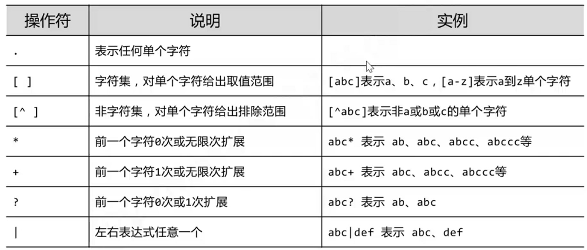
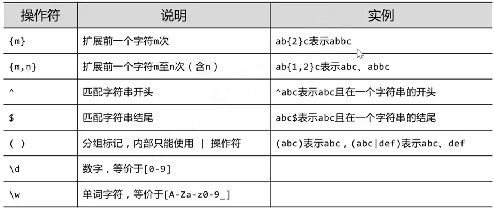
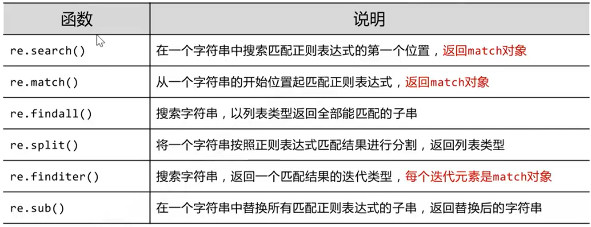
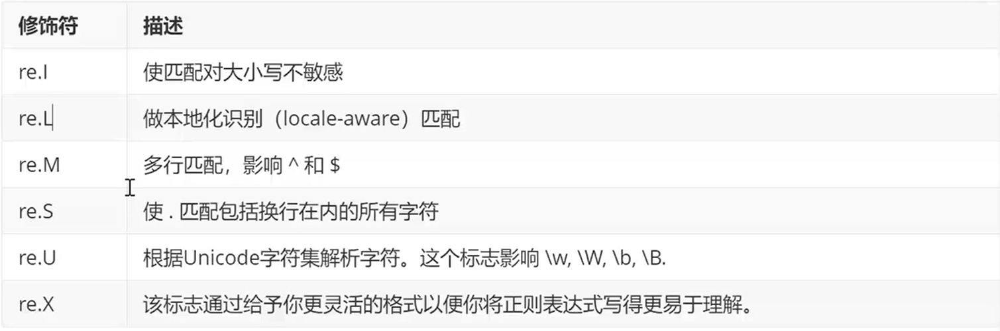
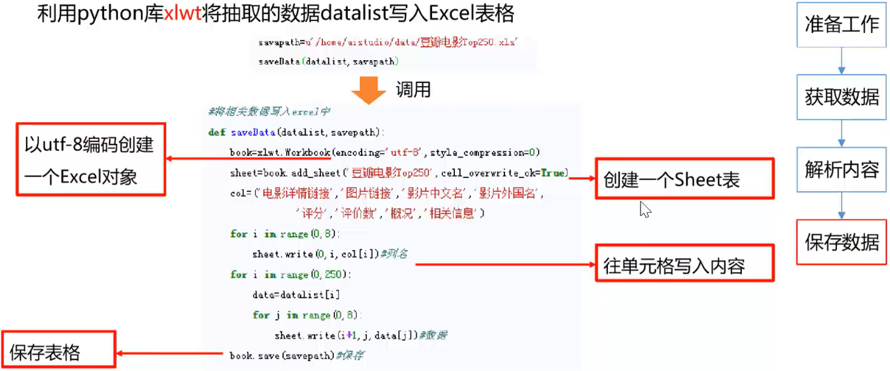
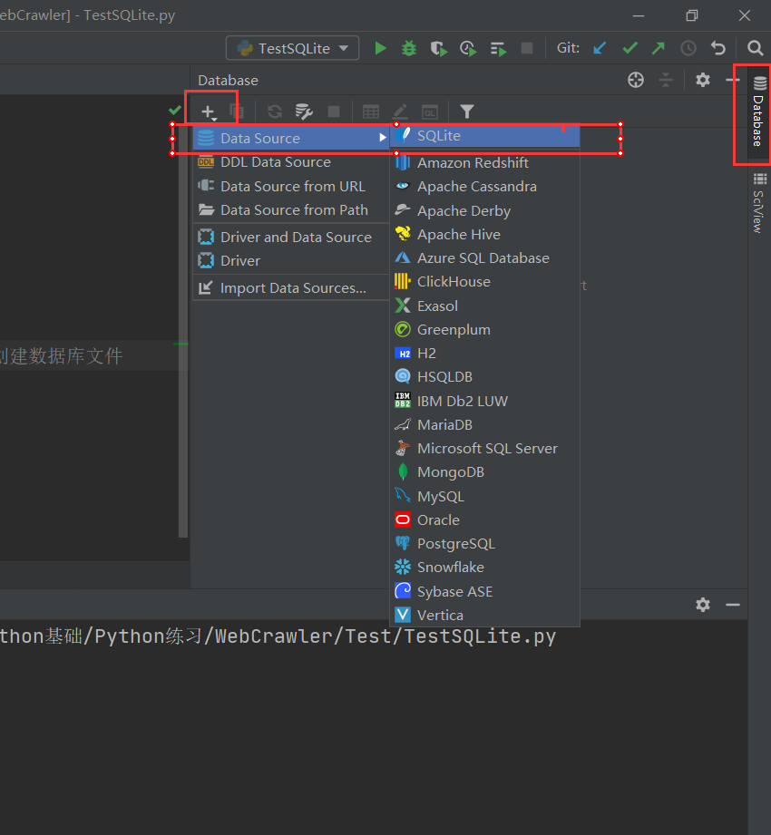
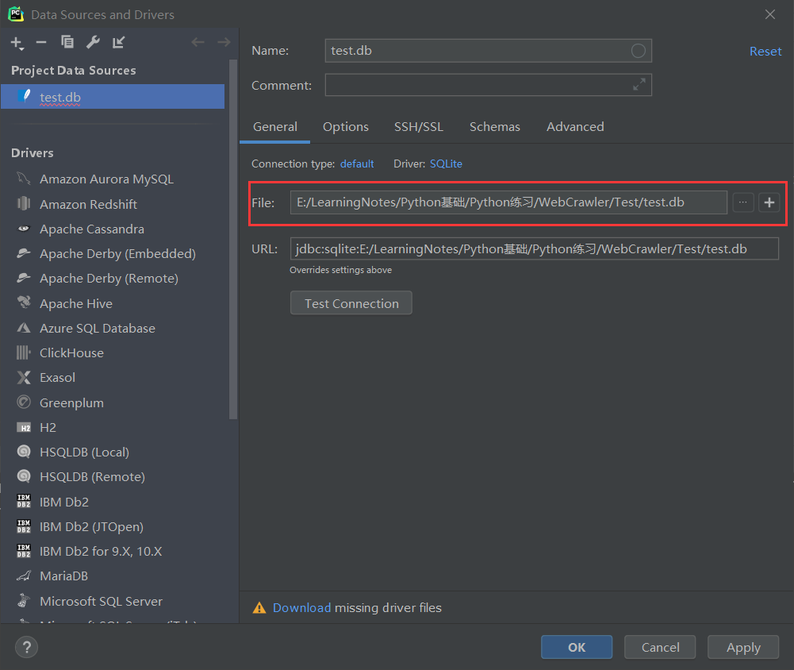
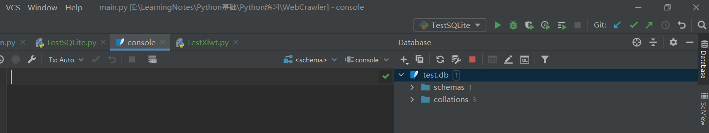
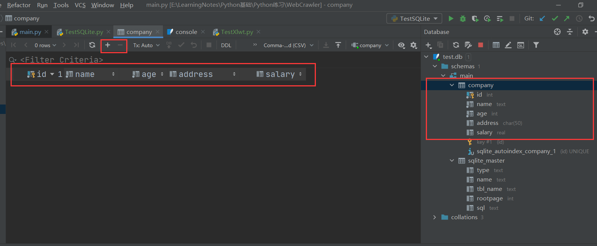

# 基础语法

## 运算符


## 条件判断语句


**注意判断条件后的冒号, 且必须缩进, 空格缩进和tab缩进均可**

```python
a = 10
if a >= 10:
    print("a>=10")
elif a >= 5:
    print(a >= 5)
else:
    print("a<5")
```

## 循环

### for循环

```python
for i in range(0, 10): # i>=0, i<10, 步进1
    print(i)
print("------------------------")
for i in range(0, 10, 3):  # i>=0, i<10, 步进3
    print(i)
```

### while循环

```python
# while测试
n = 100
sum = 0
counter = 1
while counter <=100:
    sum = sum + counter
    counter += 1

print("1到100的和为%d"%sum)

# while-else测试
counter = 1
while counter < 5:
    print("小于5")
    counter += 1
else:
    print("大于5")
```

### break, continue, pass

* break: 跳出for和while循环体
* continue: 跳出当前循环, 直接进入下一轮循环
* pass: 空语句, 一般用作占位语句, 不作任何事情

## 数据结构

### 字符串

* Python字符串可以使用单引号, 双引号, 和三引号(三个双引号)括起来, 使用反斜杠\转义特殊字符

* Python3源码文件默认以UTF-8编码, 所有字符串都是unicode字符串

* 支持字符串拼接, 截取等多种运算

```python
word ='字符串'
sentence = "这个一个句子"
paragraph = """
    这是一个段落
    可以有多行
    保留格式
"""
print(word)
print(sentence)
print(paragraph)

# 单引号和双引号有些区别
mystr1 = "I'm a student"
mystr2 = 'I\'m a student'  # 需要转义单引号
print(mystr1)
print(mystr2)
str = "chengdu"
print(str[1:7:2])  # 选择打印范围, 1~6, 步进2
print(str + "你好")  # 拼接
print(str * 3)  # 重复打印

# 转义字符与取消转义
print("hello\nchengdu")  # 反斜杠表示转义
print(r"hello\nchengdu")  # 前面加r表示直接显示, 没有转义功能
```

### 列表


  ```python
  namelist = ["孙悟空", "猪悟能", "沙悟净"]
  for name in namelist:
      print(name)
  
  # 增删改查测试
  print("增删改查测试")
  print("增")
  nametemp = input("请输入添加学生的姓名")
  namelist.append(nametemp)
  for name in namelist:
      print(name)
  # extend, insert
  
  print("删")
  del namelist[1]
  for name in namelist:
      print(name)
  
  # namelist.pop()  # 弹出最后一个元素
  # namelist.remove("孙悟空")  # 若有重复数据, 则只能删除第一个
  
  print("改")
  namelist[0] = "齐天大圣"
  for name in namelist:
      print(name)
  
  print("查")
  namefind = input("请输入要查找的名字")
  if namefind in namelist:
      print("找到了")
  else:
      print("不存在")
  
  print(namelist.index("齐天大圣", 0, 3)) # 在列表0~2的范围内查找"齐天大圣", 若查到, 则返回索引, 否则会报错
  
  print("看看列表里边有多少个齐天大圣")
  print(namelist.count("齐天大圣"))
  
  namelist.reverse()  # 反转
  namelist.sort()  # 排序(升序)
  namelist.sort(reverse=True)  # 排序(降序)
  
  ```

### 案例: 分配办公室

```python
import random

print("为每个老师随机分配办公室")

offices = [[], [], []]  # 嵌套列表
names = ["A", "B", "C", "D", "E", "F", "G", "H"]
for name in names:
    index = random.randint(0, 2)  # 随机分配索引
    offices[index].append(name)

# 打印每个办公室的人
i = 0
for office in offices:
    print("办公室%d内的人数为%d, 他们是: " % (i, len(office)))
    for name in office:
        print("%s" % name, end="\t")
    print("\n")
    i += 1
```

> 办公室0内的人数为4, 他们是: 
> A	B	E	H	
>
> 办公室1内的人数为3, 他们是: 
> C	D	F	
>
> 办公室2内的人数为1, 他们是: 
> G	

  ### 案例: 逛超市


```python
# 打印商品清单
productList = [["iphone", 6888], ["MacPro", 14800], ["小米6", 2499], ["Coffee", 31], ["Book", 60], ["Nike", 699]]
print("-"*10, "商品列表", "-"*10)

# productIndex = 0
# for product in productList:  # 逐个打印
#     print("%d\t%s\t%d" % (productIndex, product[0], product[1]))
#     productIndex += 1

# 用枚举函数替换上述代码
for i, product in enumerate(productList):
    print(i, product[0], product[1])

shopTrolley = []  # 购物车

productNumber = input("请输入要购买的商品编号(按q结束购物): ")

while not(productNumber is "q"):
    if int(productNumber) > len(productList):
        print("该商品不存在, 请重新输入")
        productNumber = input("请输入要购买的商品编号(按q结束购物): ")
    else:
        shopTrolley.append(productList[int(productNumber)])  # 添加被选择的物品
        productNumber = input("请输入要购买的商品编号(按q结束购物): ")

print("-"*10, "购物清单", "-"*10)

# productIndex = 0
# for product in shopTrolley:  #打印购物车
#     print("%d\t%s\t%d" % (productIndex, product[0], product[1]))
#     productIndex += 1

# 用枚举函数替换上面的代码
for i, product in enumerate(shopTrolley):
    print(i, product[0], product[1])

```

### 元组(tuple)

.png)

```python
tup1 = ("abc", "def", 2000, 2020, 333, 444, 555, 666)  # 必须用逗号隔开, 如果只有一个元素后面也必须加逗号

print(tup1[0])  # 访问第一个元素
print(tup1[-1])  # 访问最后一个元素
print(tup1[1:5])  # 左闭右开, 切片

# 增
tup2 = (12, 34, 56)
tup3 = ("abc", "xyz")
tup4 = tup2 + tup3
print(tup4)

# 删
# del tup2[0]  # tulle不允许删除
del tup2  # 删除了整个变量, 无法再进行打印
# print(tup2)

```

### 字典(dict, Java中叫Map)


```python
info = {"name": "孙悟空", "age": 500}

print(info["name"])
print(info["age"])

# print(info["gender"])  # 直接访问不存在的键, 会报错
print(info.get("gender"))  # 使用get方法, 若没有找到对应的键, 默认返回None
print(info.get("gender"), "m")  # 这是没有找到时的返回值, 返回m

# 增删改查
# 增
# newID = input("请输入学号: ")
# info["id"] = newID
# print(info["id"])

# 删, 分为del和clear, del可以删除整个变量, clear只是清空字典, 但是变量仍然存在
# del
print("删除一个键值对")
print("删除前: %s"%info["name"])
del info["name"]
# print("删除后: "%info["name"])  # 删除整个键值对, 再次访问报错

info["name"] = "孙悟空"

print("删除整个dict")
print("删除前: ")
print(info)
del info
print("删除后: ")
# print(info)  # 删除整个dict, 再次访问报错
print("-"*30)
# clear
info = {"name": "孙悟空", "age": 500}
print("清空: ")
print("请空前: ")
print(info)
info.clear()
print("清空后: ")
print(info)
print("-"*30)
# 查
info = {"id": "1", "name": "孙悟空", "age": 500}
print(info.keys())  # 打印所有的键(键的形式是列表)
print(info.values())  # 打印所有的值
print(info.items())  # 打印所有的项

# 遍历所有的键
print("遍历所以的键")
for key in info.keys():
    print(key)
# 遍历所有的值
print("遍历所有的值")
for value in info.values():
    print(value)
# 遍历所有的项(键值对)
print("遍历所有的项(键值对)")
for key, value in info.items():
    print("key = %s, value = %s"%(key, value))

# 使用枚举函数, 同时拿到列表中的下标和元素内容
myList = ["a", "b", "c", "d"]

for i, x in enumerate(myList):
    print(i, x)

```

### 集合(set)


### 数据结构小结


## 函数


```python
# 定义函数
def printinfo():
    print("-----------------------")
    print("      我乃齐天大圣")
    print("-----------------------")


printinfo()


# 带参数和返回值的函数
def add2Num(a, b):
    return a+b


result = add2Num(11, 22)
print(result)


# 多个返回值的函数
def divide(a, b):
    shang = a // b
    yushu = a % b
    return shang, yushu

sh, yu = divide(5, 2)
print("商: %d, 余: %d" % (sh, yu))

```

## 文件操作

```python
# 创建一个文件并打开
f = open("test.txt", "w")  # 打开文件, w模式下, 若文件不存在, 则新建
f.write("Hello world, I am here. -0\nHello world, I am here. -1\nHello world, I am here. -2")  # 写入内容
f.close()


# read方法: 读取文件中的字符, 开始时定位在文件头部, 每次执行之后自动后移
f = open("test.txt", "r")
content = f.read(5)  # 读5个字符
print(content)

content = f.read(5)  # 再读5个字符
print(content)

f.close()

# 一次性读取整个文档
f = open("test.txt", "r")
content = f.readlines()  # 读取结果是列表, 按行读, 从第一行一直读到最后一行

for i, temp in enumerate(content):  # 输出行号+内容
    print("第%d行: %s" % (i, temp), end="")
print("\n")
f.close()

# 每次读取1行
f = open("test.txt", "r")
content = f.readline()
print("第0行: %s" % content, end="")

content = f.readline()
print("第1行: %s" % content)
f.close()

# 重命名文件
# import os
# os.rename("test.txt", "test.txt")

```

## 错误与异常

```python
# 发生异常
print("----test 1----")  # 这一句正常执行

f = open("123.txt", "r")  # 打开一个不存在的文件, 报错, 下一句不再执行

print("----test 2----")

# 捕获异常
try:
    print("----test 1----")
    f = open("123.txt", "r")  # 不报错, 但下一句仍然不执行
    print("----test 2----")
except IOError:  # 文件没找到, 属于IO异常
    pass  # 捕获异常后, 执行的代码

# 同时捕获多个异常
try:
    print("----test 1----")
    f = open("123.txt", "r")  # 下面的代码不会执行, 异常也不会被捕获
    print("----test 2----")

    print(num)  # 这是一个NameError
except (NameError, IOError):  # 把可能发生的异常都放到这里
    print("产生错误了")

# 显示异常信息
try:
    print("----test 1----")
    f = open("123.txt", "r")  # 下面的代码不会执行, 异常也不会被捕获
    print("----test 2----")

    print(num)  # 这是一个NameError
except (NameError, IOError) as result:  # 把可能发生的异常都放到这里
    print("产生错误了")
    print(result)

# 捕获所有异常
try:
    print("----test 1----")
    f = open("123.txt", "r")  # 下面的代码不会执行, 异常也不会被捕获
    print("----test 2----")

    print(num)  # 这是一个NameError
except Exception as result:  # 承接所有异常
    print("产生错误了")
    print(result)

# 文件异常处理
import time

try:
    f = open("test.txt", "r")
    # f = open("123.txt", "r")  # 这里报错不能进入finally

    try:
        while True:
            content = f.readline()
            if len(content) == 0:
                break
            time.sleep(2)  # 每隔两秒打印一次
            print(content)
    finally:  # 如果读取过程中发生异常, 如上面的break, 也要保证文件正常关闭
        f.close()
        print("文件关闭")

except Exception as result:
    print("发生异常")
    print(result)

```


# 爬虫基础

## 任务介绍

爬取豆瓣电影Top250的基本信息, 包括电影的名称, 豆瓣评分, 评价数, 电影概况, 电影链接等

https://movie.douban.com/top250

## 爬虫初识


([百度指数]([百度指数 (baidu.com)](https://index.baidu.com/v2/index.html#/))可以查看关键词流量)

## 基本流程


## 准备工作


### 页面分析


* 按F12进入开发者模式, 点击Elements可以查看页面源码, 点击左上角箭头可以在页面中选择一个元素进行检查

  

* 点击Elements可以捕获向页面发送的请求, 在Headers中可以看到浏览器信息等, 爬虫时需要进行对应的封装

  

HTTP请求/响应测试网站[httpbin.org](http://httpbin.org/), 向该网站发送HTTP请求, Response body中会显示请求中包含的所有信息


### 编码规范


### 引入模块


### 使用urllib库访问网页

导包

```python
import urllib.request
import urllib.parse
```

get请求

```python
response = urllib.request.urlopen("http://www.baidu.com")
# print(response)  # 返回response对象, 其中保存了网页的所有信息
# print(response.read())  # 读取网页源代码
print(response.read().decode("utf-8"))  # 解码, 解码后的代码可以保存为html文件, 然后用浏览器打开
```

post请求

```python
# 模拟浏览器真实行为, httpbin.org会将请求信息放在Response body中返回
data = bytes(urllib.parse.urlencode({"hello": "world"}), encoding="utf-8")
response = urllib.request.urlopen("http://httpbin.org/post", data=data)  # post请求必须传参数
print(response.read().decode("utf-8"))
```

超时处理

```python
try:
    response = urllib.request.urlopen("http://httpbin.org/get", timeout=0.01)  # 设置超时时间, 超时会报错
    print(response.read().decode("utf-8"))
except urllib.error.URLError as e:
    print("time out!")
```

获取状态码

```python
response = urllib.request.urlopen("http://httpbin.org/get", timeout=1)
print(response.status)  # 获取状态码, 正常是200
```

获取Response Headers

```python
response = urllib.request.urlopen("http://www.baidu.com")
print(response.getheaders())  # 返回的是页面Response Headers中的所有信息
print(response.getheader("Server"))  # 可以获取具体的一个头信息
```

豆瓣很聪明, 发现我是爬虫了, 返回418

```python
response = urllib.request.urlopen("http://douban.com", timeout=1)
print(response.status)  # 返回418发现我是爬虫了
```

伪装成一个真正的浏览器

```python
# 包装一个req对象, 更像一个浏览器
url = "http://httpbin.org/post"

headers = {
"User-Agent": "Mozilla/5.0 (Windows NT 10.0; Win64; x64) AppleWebKit/537.36 (KHTML, like Gecko) Chrome/90.0.4430.212 Safari/537.36 Edg/90.0.818.66"
} # 这里可以加入Request Headers中的更多信息, 可以把真实Request Headers中的信息全都写进去

data = bytes(urllib.parse.urlencode({'name': 'eric'}), encoding="utf-8")
req = urllib.request.Request(url=url, data=data, headers=headers, method="POST")
response = urllib.request.urlopen(req)

print(response.read().decode("utf-8"))
```

再爬一下豆瓣试试

```python
url = "http://www.douban.com"

headers = {
"User-Agent": "Mozilla/5.0 (Windows NT 10.0; Win64; x64) AppleWebKit/537.36 (KHTML, like Gecko) Chrome/90.0.4430.212 Safari/537.36 Edg/90.0.818.66"
}

req = urllib.request.Request(url=url, headers=headers, method="POST")
response = urllib.request.urlopen(req)

print(response.read().decode("utf-8"))
```

豆瓣被骗了, 认为我是一个真正的浏览器

## 获取数据

* Python一般使用urllib库获取页面


### BeautifulSoup

BeautifulSoup4将复杂HTML文档转换成一个复杂的树形结构, 每个节点都是Python对象, 所有对象可以归纳为4类:

* Tag 标签

  ```python
  from bs4 import BeautifulSoup
  file = open("./baidu.html", "rb")  # 二进制读取
  html = file.read().decode("utf-8")
  bs = BeautifulSoup(html, "html.parser")
  # 1. Tag 标签
  # 通过bs拿到标签及其内容, 只能拿到第一个内容
  # title, a, head都是标签名, 在html代码中以<标签名>开始, </标签名>结束, 如<title>百度一下，你就知道</title>
  print(bs.title)
  print(type(bs.title))  # 类型为Tag
  print(bs.a)
  print(bs.head)
  ```

* NavigableString 标签里的内容

  ```python
  print(bs.title.string)
  print(type(bs.title.string))  # 类型为NavigableString
  
  print(bs.a.attrs)  # 获取标签中的所有属性
  ```

* BeautifulSoup 表示整个html文档

  ```python
  print(bs.name)  # 名字叫document
  print(bs.attrs)  # 没有属性
  print(bs)  # 打印整个html文档
  ```

* Comment 注释, 是一个特殊的NavigableString, 输出内容不包含注释符号

  ```python
  print(bs.a)  # 带注释打印
  print(bs.a.string)  # 自动去掉注释
  print(type(bs.a.string))  # 网上这个类型是bs4.element.comment, 我的运行结果是bs4.element.NavigableString, 暂时不知道为什么
  ```

文档遍历

```python
print(bs.head.contents)  # 这是个列表
print(bs.head.contents[0])
# 更多内容搜索BeautifulSoup遍历树
```

文档搜索

(1) find_all

* 字符串过滤, 查找与字符串完全匹配的内容, 按标签查找

  ```python
  t_list = bs.find_all("a")
  print(t_list)  # 打印a标签包含的所有内容
  ```

* 正则表达式搜索: 可以使用search()方法匹配内容, 按标签找

  ```python
  t_list = bs.find_all(re.compile("a"))  # 查找所有含有a的标签
  print(t_list)
  ```

* 定义方法搜索

  ```python
  def name_is_exists(tag):
      return tag.has_attr("name")
  
  
  t_list = bs.find_all(name_is_exists)
  # print(t_list)
  for item in t_list:  # 按列表打印
      print(item)
  ```

(2) kwargs  参数

```python
t_list = bs.find_all(id="head")  # 按id查找
t_list = bs.find_all(class_=True)  # 带class的全要
t_list = bs.find_all(href="http://news.baidu.com")  # 按href查找
for item in t_list:  # 按列表打印
    print(item)
```

(3) 文本查找, text参数

```python
t_list = bs.find_all(text = "hao123")  # 查找文本

t_list = bs.find_all(text=["hao123", "地图", "贴吧"])  # 查找多个文本

t_list = bs.find_all(text=re.compile("\d"))  # 用正则表达式查找包含特定文本的内容(标签里的字符串)
```

(4) limit参数

```python
t_list = bs.find_all("a", limit=3)  # 限定数量
for item in t_list:
    print(item)
```

(5) css选择器

```python
t_list = bs.select('title')  #通过标签查找

t_list = bs.select(".mnav")  # 通过类名查找

t_list = bs.select("#u1")  #通过id查找, id=u1

t_list = bs.select("a[class]")  # 通过属性查找, 查找a标签下的class属性
t_list = bs.select("a[class=toindex]")

t_list = bs.select("head > meta")  # 通过子标签查找

t_list = bs.select("meta ~ link")  # 通过兄弟标签查找, 查找meta标签的兄弟link标签

for item in t_list:
    print(item)
```

### RE: 正则表达式

常用操作符:





[常用正则表达式](https://www.cnblogs.com/fozero/p/7868687.html)

RE库主要功能函数



修饰符控制匹配的模式



```python
import re

# 创建模式对象
pat = re.compile("AA")  # 此处的AA是正则表达式, 用来检验其他的字符串
m = pat.search("CBA")  # CBA是被检验的字符串
print(m)  # 返回none表示没有匹配的结果

m = pat.search("ABCAA")
print(m)  # 下标3,4匹配

m = pat.search("ABCAADDCCAA")
print(m)  # search方法只返回第一次匹配的结果


# 不创建模式对象
m = re.search("asd", "Aasd")  # 第一个参数是规则, 第二个参数是被检验的对象
print(m)

print(re.findall("a", "ASDaDFGAa"))  # 前面字符串是规则(正则表达式), 后面字符串是被检验的字符串, 打印所有符合条件的字符串

print(re.findall("[A-Z]", "ASDaDFGAa"))  # 打印字符串中所有大写字母

print(re.findall("[A-Z]+", "ASDaDFGAa"))  # >=一个大写字母则匹配

# sub, 替换
print(re.sub("a", "A", "abcdcasd"))  # 找到a, 并用A替换
# 建议在正则表达式中, 被检验的字符串前加上r, 避免转义字符的问题
a = r"\aadafsd-\'"
print(a)
```

## 解析数据

### 标签解析

```python
        soup = BeautifulSoup(html, "html.parser")
        for item in soup.find_all('div', class_="item"):  # div标签, class(属性) = item
            # print(item)  # 测试, 查看电影item, 全部信息
```

### 正则提取

打印一个影片的所有信息, 保存为html, 方便分析

```html
<div class="item">
<div class="pic">
<em class="">1</em>
<a href="https://movie.douban.com/subject/1292052/">

</a>
</div>
<div class="info">
<div class="hd">
<a class="" href="https://movie.douban.com/subject/1292052/">
<span class="title">肖申克的救赎</span>
<span class="title"> / The Shawshank Redemption</span>
<span class="other"> / 月黑高飞(港)  /  刺激1995(台)</span>
</a>
<span class="playable">[可播放]</span>
</div>
<div class="bd">
<p class="">
                            导演: 弗兰克·德拉邦特 Frank Darabont   主演: 蒂姆·罗宾斯 Tim Robbins /...<br/>
                            1994 / 美国 / 犯罪 剧情
                        </p>
<div class="star">
<span class="rating5-t"></span>
<span class="rating_num" property="v:average">9.7</span>
<span content="10.0" property="v:best"></span>
<span>2358809人评价</span>
</div>
<p class="quote">
<span class="inq">希望让人自由。</span>
</p>
</div>
</div>
</div>
```

根据上面的html代码, 定义提取规则

```python
import re
# 影片详情链接
findLink = re.compile(r'<a href="(.*?)">')  # 创建正则表达式对象, 表示规则, 用来查找链接 <a href="https://movie.douban.com/subject/1291560/">
# 影片图片链接
findImgSrc = re.compile(r'(.*)</span>')
# 影片评分
findRating = re.compile(r'<span class="rating_num" property="v:average">(.*)</span>')
# 评价人数
findJudge = re.compile(r'<span>(\d*)人评价</span>')
# 找到概况
findInq = re.compile(r'<span class="inq">(.*)</span>')
# 相关内容
findBd = re.compile(r'<p class="">(.*)</p>', re.S)

# 打印
link = re.findall(findLink, item)[0]  # re库用来通过正则表达式查找指定的字符串,
print(link)  # 打印链接
```

## 保存数据

### Excel保存



```python
import xlwt

workBook = xlwt.Workbook(encoding="utf-8")  # 创建workBook对象
workSheet = workBook.add_sheet('sheet1')  # 创建工作表
workSheet.write(0, 0, 'hello')  # 写入参数, 行, 列, 内容
workBook.save('students.xls')
```

将dataList中的数据保存到excel文件"豆瓣电影Top250.xls"中

```python
def SaveData(savePath, dataList):
    print("save....")
    book = xlwt.Workbook(encoding="utf-8", style_compression=0)  # 创建workBook对象
    sheet = book.add_sheet('sheet1', cell_overwrite_ok=True)  # 创建工作表
    col = ("电影详情链接", "图片链接", "中文名", "外文名", "评分", "评价数", "概况", "相关信息")  # 列名
    for i in range(0, 8):
        sheet.write(0, i, col[i])  # 列名
    for i in range(0, 250):  # 保存250条信息
        print("第%d条" % (i+1))
        data = dataList[i]
        for j in range(0, 8):  # 每条信息有8列
            sheet.write(i+1, j, data[j])
    print("爬取完毕!")
    book.save(savePath)
```

### SQLite数据库

(1) 新建数据库文件, 穿件完毕后Project目录下显示test.db文件

```python
import sqlite3

conn = sqlite3.connect("test.db")  # 打开或创建数据库文件
print("Opened database successfully")
```

打开数据库文件







右侧的控制台可以进行数据库操作, 与代码操作效果相同.

[SQLite 数据类型 | 菜鸟教程 (runoob.com)](https://www.runoob.com/sqlite/sqlite-data-types.html)

(2) 创建数据表

```python
c = conn.cursor()  # 获取游标
# 编写SQL语句, 插入id, name, age, address, salary
sql = '''  
    create table company
        (id int primary key not null,
        name text not null,
        age int not null,
        address char(50),
        salary real);
'''

c.execute(sql)  # 执行sql语句
conn.commit()  # 提交数据库操作
conn.close()  # 关闭数据库链接
print("成功建表")
```

在数据库中观察执行结果, 加减号可以添加数据



(3) 插入数据

```python
sql1 = '''
    insert into company (id, name, age, address, salary)
    values(1, "孙悟空", 500, "花果山", 8000);
'''
sql2 = '''
    insert into company (id, name, age, address, salary)
    values(2, "猪悟能", 400, "高老庄", 7000);
'''

c.execute(sql1)  # 执行sql语句
c.execute(sql2)
conn.commit()  # 提交数据库操作
conn.close()  # 关闭数据库链接
```

(4) 查询数据

```python
sql = "select id, name, address, salary from company"
cursor = c.execute(sql)
for row in cursor:
    print("id = ", row[0])
    print("name = ", row[1])
    print("address = ", row[2])
    print("salary = ", row[3], "\n")

print("查询完毕")
```

打印结果

> id =  1
> name =  孙悟空
> address =  花果山
> salary =  8000.0 
>
> id =  2
> name =  猪悟能
> address =  高老庄
> salary =  7000.0 

### 将爬虫结果保存到SQLite数据库

* 初始化数据库

  ```python
  def Init_db(dbPath):
      sql = '''
          create table movie250
          (
              id integer primary key autoincrement,
              info_link text, 
              pic_link text, 
              cname varchar,
              ename varchar,
              score numeric,
              rated numeric, 
              introduction text,
              info text
          )
      '''  # 创建数据表
  
      conn = sqlite3.connect(dbPath)
      cursor = conn.cursor()
      cursor.execute(sql)
      conn.commit()
      conn.close()
  ```

* 在数据表中插入数据

  ```python
  # 将数据保存到SQLite
  def SaveData2DB(dbPath, dataList):
      Init_db(dbPath)
      conn = sqlite3.connect(dbPath)
      cur = conn.cursor()
      for data in dataList:
          for index in range(len(data)):
              if index == 4 or index == 5:  # 第四列和第五列是评分和评价人数, 是数字不是字符串, 所以不需要加双引号
                  continue
              data[index] = '"' + data[index] + '"'  # 给每一项数据加双引号
          sql = '''
              insert into movie250 (
                  info_link, pic_link, cname, ename, score, rated, introduction, info
              )  
              values(%s)''' % ",".join(data)  # 用逗号把data中的数据隔开, 并链接到每一列, 因为id设置了自增, 所以不需要手动插入
          print(sql)
          cur.execute(sql)
          conn.commit()
      cur.close()
      conn.close()
  ```

* 执行

  ```python
  dataList = GetData(baseUrl)
  dbPath = "豆瓣电影Top250.db"  # 数据库地址
  SaveData2DB(dbPath, dataList)
  ```

## 完整源代码

```python
from bs4 import BeautifulSoup
import re  # 正则表达式, 进行文字匹配
import urllib.request, urllib.error  # 制定URL, 获取网页数据
import xlwt  # 进行excel操作
import sqlite3  # 进行SQLite数据库操作

# 影片详情链接
findLink = re.compile(r'<a href="(.*?)">')  # 创建正则表达式对象, 表示规则, 用来查找链接 <a href="https://movie.douban.com/subject/1291560/">
# 影片图片链接
findImgSrc = re.compile(r'(.*)</span>')
# 影片评分
findRating = re.compile(r'<span class="rating_num" property="v:average">(.*)</span>')
# 评价人数
findJudge = re.compile(r'<span>(\d*)人评价</span>')
# 找到概况
findInq = re.compile(r'<span class="inq">(.*)</span>')
# 相关内容
findBd = re.compile(r'<p class="">(.*?)</p>', re.S)


def main():
    baseUrl = "https://movie.douban.com/top250?start="
    # 1. 爬取网页
    dataList = GetData(baseUrl)
    savePath = "豆瓣电影Top250.xls"  # excel保存地址
    dbPath = "豆瓣电影Top250.db"  # 数据库地址
    # 3. 保存数据
    # SaveData(savePath, dataList)  # 将数据保存到excel
    SaveData2DB(dbPath, dataList)


# 爬取网页
def GetData(baseUrl):

    dataList = []
    for i in range(0, 10):  # 调用获取页面信息的函数, 10次
        url = baseUrl + str(i*25)
        html = AskUrl(url)  # 保存获取到的网页源码

        # 2. 逐一解析数据
        soup = BeautifulSoup(html, "html.parser")
        for item in soup.find_all('div', class_="item"):  # div标签, class(属性) = item
            # print(item)  # 测试, 查看电影item, 全部信息
            data = []  # 保存一部电影的所有信息
            item = str(item)  # 变成字符串, 方便用正则表达式

            # 影片详情的链接
            link = re.findall(findLink, item)[0]  # re库用来通过正则表达式查找指定的字符串
            data.append(link)
            imgSrc = re.findall(findImgSrc, item)[0]
            data.append(imgSrc)

            titles = re.findall(findTitle, item)
            # 影片可能只有一个中文名, 也可能有一个中文名和一个外文名, 需要分别处理
            if(len(titles) == 2):
                ctitle = titles[0]
                data.append(ctitle)  # 中文名
                otitle = titles[1].replace("/", "")
                data.append(otitle)  # 外文名, 去掉/
            else:
                data.append(titles[0])  # 中文名
                data.append(' ')  # 留空

            rating = re.findall(findRating, item)[0]
            data.append(rating)

            judgeNum = re.findall(findJudge, item)[0]
            data.append(judgeNum)

            inq = re.findall(findInq, item)
            if len(inq) != 0:
                inq = inq[0].replace("。", "")
                data.append(inq)
            else:
                data.append(" ")

            bd = re.findall(findBd, item)[0]
            bd = re.sub('<br(\s+)?/>(\s+)?', " ", bd)  # 去掉<br/>
            bd = re.sub('/', " ", bd)  # 替换/
            data.append(bd.strip())

            dataList.append(data)  # 保存处理好的一部电影信息

    # print(dataList)
    return dataList


# 得到指定一个URL的网页内容
def AskUrl(url):
    head = {  # 模拟浏览器头部信息, 想豆瓣服务器发送消息
    "User-Agent":"Mozilla / 5.0(Windows NT 10.0;Win64;x64) AppleWebKit / 537.36(KHTML, likeGecko) Chrome / 90.0.4430.212Safari / 537.36Edg / 90.0.818.66"
    }  # 用户代理, 发送服务器信息, 告诉豆瓣我们是什么类型的机器/浏览器, 本质上是高速浏览器, 我们可以接收什么水平的文件内容
    # User-Agent一定不能有空格

    request = urllib.request.Request(url, headers=head)
    html = ""
    try:
        response = urllib.request.urlopen(request)
        html = response.read().decode("utf-8")
        # print(html)
    except urllib.error.URLError as e:
        if hasattr(e, "code"):  # 如果返回信息中有"code"标签, 则打印出来
            print(e.code)
        if hasattr(e, "reason"):
            print(e.reason)

    return html


# 将数据保存到excel
def SaveData(savePath, dataList):
    print("save....")
    book = xlwt.Workbook(encoding="utf-8", style_compression=0)  # 创建workBook对象
    sheet = book.add_sheet('sheet1', cell_overwrite_ok=True)  # 创建工作表
    col = ("电影详情链接", "图片链接", "中文名", "外文名", "评分", "评价数", "概况", "相关信息")  # 列名
    for i in range(0, 8):
        sheet.write(0, i, col[i])  # 列名
    for i in range(0, 250):  # 保存250条信息
        print("第%d条" % (i+1))
        data = dataList[i]
        for j in range(0, 8):  # 每条信息有8列
            sheet.write(i+1, j, data[j])
    print("爬取完毕!")
    book.save(savePath)  #  # 将数据


# 将数据保存到SQLite
def SaveData2DB(dbPath, dataList):
    Init_db(dbPath)
    conn = sqlite3.connect(dbPath)
    cur = conn.cursor()
    for data in dataList:
        for index in range(len(data)):
            if index == 4 or index == 5:  # 第四列和第五列是评分和评价人数, 是数字不是字符串, 所以不需要加双引号
                continue
            data[index] = '"' + data[index] + '"'  # 给每一项数据加双引号
        sql = '''
            insert into movie250 (
                info_link, pic_link, cname, ename, score, rated, introduction, info
            )  
            values(%s)''' % ",".join(data)  # 用逗号把data中的数据隔开, 并链接到每一列, 因为id设置了自增, 所以不需要手动插入
        print(sql)
        cur.execute(sql)
        conn.commit()
    cur.close()
    conn.close()


def Init_db(dbPath):
    sql = '''
        create table movie250
        (
            id integer primary key autoincrement,
            info_link text, 
            pic_link text, 
            cname varchar,
            ename varchar,
            score numeric,
            rated numeric, 
            introduction text,
            info text
        )
    '''  # 创建数据表
    conn = sqlite3.connect(dbPath)
    cursor = conn.cursor()
    cursor.execute(sql)
    conn.commit()
    conn.close()


# Press the green button in the gutter to run the script.
if __name__ == '__main__':
    main()
    print("爬取完毕!")
    
```

